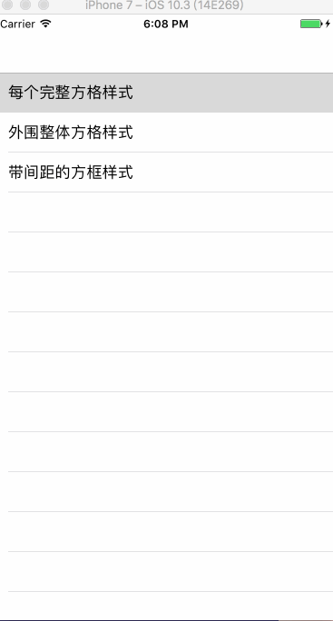

# JJCPayCodeTextField
<p>
  

## Note
iOS 支付密码框
<p>

## Use
```
pod 'JJCPayCodeTextField'
```
<p>

## The function
- 1、支持三种样式；
- 2、支持动态设置输入框数目；
- 3、支持更改边框颜色；
- 4、在为方框样式时，支持设置方框间间距；
- 5、支持明文、密文状态切换；
- 6、支持手动清除已输入的支付码；
- 7、支持实时获取已输入的支付密码及当前输入字符；
- 8、支持变更密文字符样式（暂时只支持字符，不支持图片）。
<p>
  
## 演示GIF


